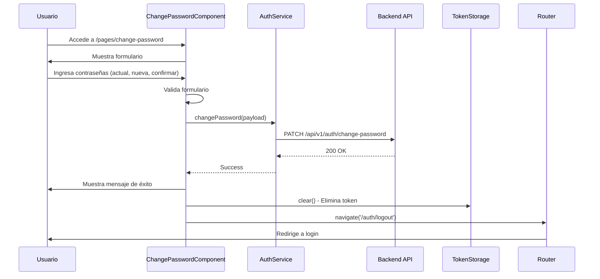
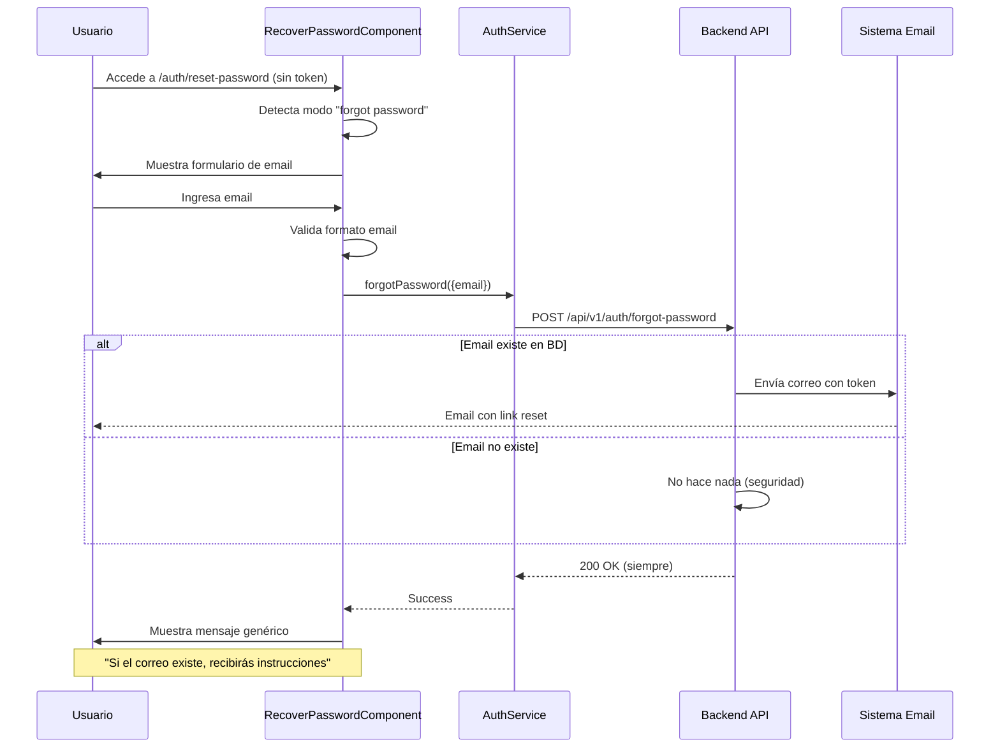
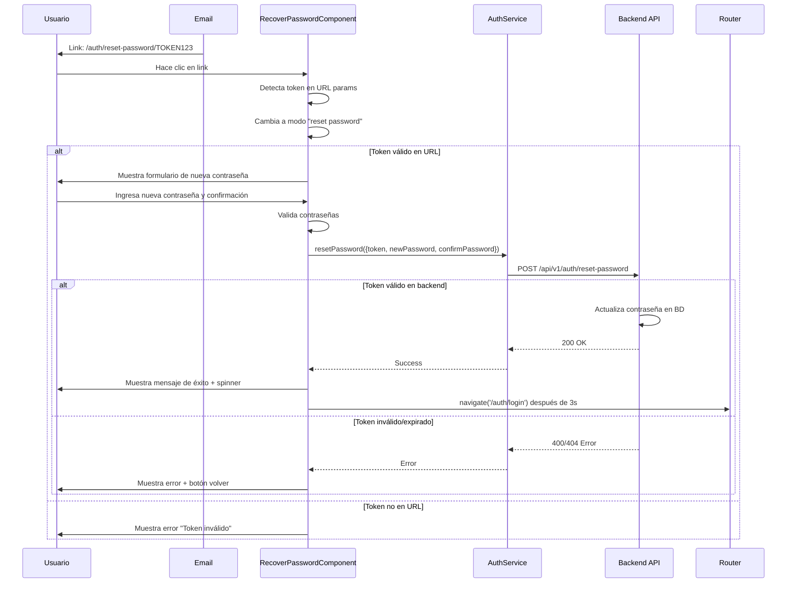

# Gestión de Contraseñas - Sistema de Autenticación

## 📋 Índice

1. [Introducción](#introducción)
2. [Arquitectura General](#arquitectura-general)
3. [Endpoints del Backend](#endpoints-del-backend)
4. [Componentes Frontend](#componentes-frontend)
5. [Flujos de Usuario](#flujos-de-usuario)
6. [Validaciones y Seguridad](#validaciones-y-seguridad)
7. [Manejo de Errores](#manejo-de-errores)
8. [Guía de Integración](#guía-de-integración)

---

## Introducción

Este documento describe el sistema completo de gestión de contraseñas implementado en la aplicación OOTS Colombia. El sistema incluye tres flujos principales:

1. **Cambio de contraseña**: Para usuarios autenticados que desean cambiar su contraseña actual
2. **Recuperación de contraseña**: Para usuarios que olvidaron su contraseña (sin autenticación)
3. **Restablecimiento de contraseña**: Para establecer una nueva contraseña mediante token de recuperación

---

## Arquitectura General

### Estructura de Archivos

```
src/app/
├── core/
│   ├── interfaces/
│   │   └── auth.interface.ts          # DTOs y tipos de respuesta
│   ├── services/
│   │   └── auth.service.ts            # Métodos HTTP para gestión de contraseñas
│   └── validators/
│       └── password-match.validator.ts # Validador personalizado de contraseñas
└── auth/
    └── account/
        ├── change-password/           # Componente para cambiar contraseña (autenticado)
        │   ├── change-password.component.ts
        │   ├── change-password.component.html
        │   └── change-password.component.scss
        └── recover-password/          # Componente multi-propósito para recuperación y reset
            ├── recover-password.component.ts
            ├── recover-password.component.html
            └── recover-password.component.scss
```

### Rutas Configuradas

```typescript
// Rutas públicas (auth-routing.module.ts)
/auth/reset-password             → RecoverPasswordComponent (modo: solicitar recuperación)
/auth/reset-password/:token      → RecoverPasswordComponent (modo: restablecer con token)

// Rutas autenticadas (pages.routes.ts)
/pages/change-password          → ChangePasswordComponent
```

**Nota**: El componente `RecoverPasswordComponent` es inteligente y detecta automáticamente si hay un token en la URL para mostrar el formulario apropiado:

- **Sin token**: Muestra formulario de "olvidé mi contraseña" (solo email)
- **Con token**: Muestra formulario de restablecimiento (nueva contraseña + confirmación)

---

## Endpoints del Backend

### 1. Cambiar Contraseña (Autenticado)

**Endpoint**: `PATCH /api/v1/auth/change-password`

**Headers**:

```http
Authorization: Bearer {token}
Content-Type: application/json
```

**Request Body**:

```json
{
  "currentPassword": "ContraseñaActual123!",
  "newPassword": "NuevaContraseña456!",
  "confirmPassword": "NuevaContraseña456!"
}
```

**Response Success (200)**:

```json
{
  "statusCode": 200,
  "message": "Contraseña actualizada exitosamente",
  "timestamp": "2024-01-15T10:30:00.000Z",
  "path": "/api/v1/auth/change-password"
}
```

**Posibles Errores**:

- `400`: Contraseña actual incorrecta
- `401`: Token de autenticación inválido o expirado
- `422`: Las contraseñas no coinciden o no cumplen requisitos de seguridad

---

### 2. Solicitar Recuperación de Contraseña (Público)

**Endpoint**: `POST /api/v1/auth/forgot-password`

**Headers**:

```http
Content-Type: application/json
```

**Request Body**:

```json
{
  "email": "usuario@ejemplo.com"
}
```

**Response Success (200)**:

```json
{
  "statusCode": 200,
  "message": "Si el correo electrónico existe, recibirás instrucciones para restablecer tu contraseña",
  "timestamp": "2024-01-15T10:35:00.000Z",
  "path": "/api/v1/auth/forgot-password"
}
```

> **Nota de Seguridad**: El backend siempre devuelve el mismo mensaje (200) independientemente de si el email existe o no. Esto previene enumeration attacks.

**Posibles Errores**:

- `422`: Email con formato inválido
- `500`: Error del servidor

---

### 3. Restablecer Contraseña con Token (Público)

**Endpoint**: `POST /api/v1/auth/reset-password`

**Headers**:

```http
Content-Type: application/json
```

**Request Body**:

```json
{
  "token": "eyJhbGciOiJIUzI1NiIsInR5cCI6IkpXVCJ9...",
  "newPassword": "NuevaContraseña789!",
  "confirmPassword": "NuevaContraseña789!"
}
```

**Response Success (200)**:

```json
{
  "statusCode": 200,
  "message": "Contraseña restablecida exitosamente",
  "timestamp": "2024-01-15T10:40:00.000Z",
  "path": "/api/v1/auth/reset-password"
}
```

**Posibles Errores**:

- `400`: Token inválido o expirado
- `404`: Token no encontrado
- `422`: Las contraseñas no coinciden o no cumplen requisitos de seguridad

---

## Componentes Frontend

### 1. ChangePasswordComponent

**Ruta**: `/pages/change-password` (requiere autenticación)

**Características**:

- Formulario reactivo con 3 campos: contraseña actual, nueva contraseña, confirmar contraseña
- Botones de visibilidad para mostrar/ocultar contraseñas
- Validación en tiempo real con mensajes de error específicos
- Logout automático después de cambiar la contraseña exitosamente
- Redirección al login después del logout

**Validaciones**:

- Contraseña actual: requerida
- Nueva contraseña:
  - Requerida
  - Mínimo 8 caracteres
  - Debe contener: mayúsculas, minúsculas, números y caracteres especiales
- Confirmar contraseña: debe coincidir con nueva contraseña

**Flujo de Usuario**:

```
Usuario ingresa contraseñas → Valida formulario → Envía PATCH request
→ Éxito: Muestra mensaje → Hace logout → Redirige a login (3s)
→ Error: Muestra mensaje de error específico
```

---

### 2. RecoverPasswordComponent (Multi-propósito)

**Rutas**:

- `/auth/reset-password` (público - solicitar recuperación)
- `/auth/reset-password/:token` (público - restablecer con token)

**Características**:

- **Componente inteligente** que detecta automáticamente el modo de operación según la presencia del token en la URL
- **Modo "Forgot Password"** (sin token):
  - Formulario simple con campo de email
  - Mensaje de éxito genérico por seguridad
  - No revela si el email existe en el sistema
  - Información sobre revisar carpeta de spam
- **Modo "Reset Password"** (con token):
  - Lee token desde parámetros de URL
  - Valida token al cargar
  - Formulario con nueva contraseña y confirmación
  - Botones de visibilidad para contraseñas
  - Redirección automática al login tras éxito (3s)

**Validaciones Modo Forgot**:

- Email: requerido y formato válido

**Validaciones Modo Reset**:

- Token: extraído de URL y validado
- Nueva contraseña:
  - Requerida
  - Mínimo 8 caracteres
  - Debe contener: mayúsculas, minúsculas, números y caracteres especiales
- Confirmar contraseña: debe coincidir con nueva contraseña

**Flujo de Usuario (Forgot Password)**:

```
Usuario accede a /auth/reset-password → Ingresa email → Valida formato
→ Envía POST request → Siempre muestra mensaje de éxito (seguridad)
→ Backend envía email solo si existe el usuario
→ Botón para volver al login
```

**Flujo de Usuario (Reset Password)**:

```
Usuario hace clic en link del email → Carga /auth/reset-password/:token
→ Componente detecta token → Valida token existe → Muestra formulario
→ Usuario ingresa nueva contraseña → Valida y envía POST request
→ Éxito: Muestra mensaje → Redirige a login (3s)
→ Error: Muestra mensaje específico (token expirado/inválido)
```

---

## Flujos de Usuario

### Flujo 1: Cambio de Contraseña (Usuario Autenticado)



---

### Flujo 2: Recuperación de Contraseña (Usuario No Autenticado)



---

### Flujo 3: Restablecimiento con Token



---

## Validaciones y Seguridad

### Validador Personalizado: `passwordMatchValidator`

**Ubicación**: `src/app/core/validators/password-match.validator.ts`

**Implementación**:

```typescript
import { AbstractControl, ValidationErrors, ValidatorFn } from '@angular/forms';

export function passwordMatchValidator(passwordField: string, confirmPasswordField: string): ValidatorFn {
  return (control: AbstractControl): ValidationErrors | null => {
    const password = control.get(passwordField);
    const confirmPassword = control.get(confirmPasswordField);

    if (!password || !confirmPassword) {
      return null;
    }

    if (confirmPassword.value === '') {
      return null;
    }

    return password.value === confirmPassword.value ? null : { passwordMismatch: true };
  };
}
```

**Uso**:

```typescript
this.form = this.formBuilder.group(
  {
    password: ['', [Validators.required, Validators.minLength(8)]],
    confirmPassword: ['', [Validators.required]],
  },
  {
    validators: passwordMatchValidator('password', 'confirmPassword'),
  }
);
```

---

### Requisitos de Contraseña

Todas las contraseñas deben cumplir con:

- **Longitud mínima**: 8 caracteres
- **Mayúsculas**: Al menos 1 letra mayúscula (A-Z)
- **Minúsculas**: Al menos 1 letra minúscula (a-z)
- **Números**: Al menos 1 dígito (0-9)
- **Caracteres especiales**: Al menos 1 símbolo (@$!%\*?&)

**Patrón Regex**:

```typescript
/^(?=.*[a-z])(?=.*[A-Z])(?=.*\d)(?=.*[@$!%*?&])[A-Za-z\d@$!%*?&]/;
```

---

### Medidas de Seguridad Implementadas

1. **Enumeration Prevention**: El endpoint de forgot-password siempre devuelve el mismo mensaje
2. **Token Expiration**: Los tokens de recuperación tienen tiempo de expiración
3. **HTTPS Only**: Toda comunicación con el backend debe usar HTTPS en producción
4. **Password Hashing**: Las contraseñas se almacenan con bcrypt en el backend
5. **Rate Limiting**: (Recomendado) Implementar límite de intentos en el backend
6. **Logout After Change**: Usuario debe volver a autenticarse después de cambiar contraseña

---

## Manejo de Errores

### Códigos de Estado HTTP

| Código | Escenario                                                              | Mensaje al Usuario                                           |
| ------ | ---------------------------------------------------------------------- | ------------------------------------------------------------ |
| 200    | Operación exitosa                                                      | Mensaje de éxito específico                                  |
| 400    | Bad Request (token inválido, contraseña actual incorrecta)             | "Token inválido o expirado" / "Contraseña actual incorrecta" |
| 401    | No autenticado o token JWT inválido                                    | "Sesión expirada. Por favor inicia sesión nuevamente"        |
| 404    | Token de recuperación no encontrado                                    | "Token no encontrado. Solicita un nuevo enlace"              |
| 422    | Validación fallida (contraseñas no coinciden, requisitos no cumplidos) | "La contraseña no cumple con los requisitos de seguridad"    |
| 500    | Error interno del servidor                                             | "Error del servidor. Intenta nuevamente más tarde"           |

---

### Ejemplo de Manejo de Errores en Componentes

```typescript
this.authService.changePassword(payload).subscribe({
  next: (response) => {
    this.successMessage = 'Contraseña cambiada exitosamente';
    // Acciones adicionales...
  },
  error: (error) => {
    if (error.status === 400) {
      this.errorMessage = 'La contraseña actual es incorrecta';
    } else if (error.status === 401) {
      this.errorMessage = 'Sesión expirada. Inicia sesión nuevamente';
      this.router.navigate(['/auth/login']);
    } else if (error.status === 422) {
      this.errorMessage = 'Las contraseñas no coinciden o no cumplen los requisitos';
    } else {
      this.errorMessage = 'Error al cambiar la contraseña';
    }
  },
});
```

---

## Guía de Integración

### Paso 1: Agregar Enlaces en la UI

#### En el formulario de Login

```html
<!-- src/app/auth/account/login/login.component.html -->
<div class="text-center">
  <p class="text-muted">
    <a [routerLink]="['/auth/reset-password']" class="text-muted ms-1">
      <i class="mdi mdi-lock"></i> ¿Olvidaste tu contraseña?
    </a>
  </p>
</div>
```

#### En el menú de usuario (topbar)

```html
<!-- src/app/layout/shared/topbar/topbar.component.html -->
<a class="dropdown-item notify-item" [routerLink]="['/pages/change-password']">
  <i class="mdi mdi-lock-reset font-16 me-1"></i>
  <span>Cambiar Contraseña</span>
</a>
```

---

### Paso 2: Configurar Variables de Entorno

Asegúrate de que la URL base del API esté configurada:

```typescript
// src/environments/environment.ts
export const environment = {
  production: false,
  apiUrl: 'http://localhost:3000/api/v1',
};

// src/environments/environment.prod.ts
export const environment = {
  production: true,
  apiUrl: 'https://api.ootscolombia.com/api/v1',
};
```

---

### Paso 3: Configurar Email Template en el Backend

El backend debe enviar un email con un enlace como:

```
https://app.ootscolombia.com/auth/reset-password/TOKEN_AQUI
```

**Ejemplo de Email HTML**:

```html
<!DOCTYPE html>
<html>
  <head>
    <meta charset="UTF-8" />
    <title>Restablecer Contraseña - OOTS Colombia</title>
  </head>
  <body style="font-family: Arial, sans-serif; max-width: 600px; margin: 0 auto;">
    <div style="background-color: #f8f9fa; padding: 20px; text-align: center;">
      
    </div>

    <div style="padding: 30px; background-color: #ffffff;">
      <h2 style="color: #333;">Restablecer tu contraseña</h2>

      <p>Hola,</p>

      <p>Recibimos una solicitud para restablecer la contraseña de tu cuenta en OOTS Colombia.</p>

      <p style="text-align: center; margin: 30px 0;">
        <a
          href="{{RESET_LINK}}"
          style="background-color: #007bff; 
                color: white; 
                padding: 12px 30px; 
                text-decoration: none; 
                border-radius: 5px; 
                display: inline-block;"
        >
          Restablecer Contraseña
        </a>
      </p>

      <p><strong>Este enlace expirará en 1 hora.</strong></p>

      <p>Si no solicitaste restablecer tu contraseña, puedes ignorar este correo de forma segura.</p>

      <hr style="border: none; border-top: 1px solid #e0e0e0; margin: 30px 0;" />

      <p style="font-size: 12px; color: #6c757d;">
        Si tienes problemas haciendo clic en el botón, copia y pega el siguiente enlace en tu navegador:
        <br />
        <a href="{{RESET_LINK}}" style="color: #007bff;">{{RESET_LINK}}</a>
      </p>
    </div>

    <div style="background-color: #f8f9fa; padding: 20px; text-align: center; font-size: 12px; color: #6c757d;">
      <p>© 2024 OOTS Colombia. Todos los derechos reservados.</p>
    </div>
  </body>
</html>
```

---

### Paso 4: Testing del Flujo Completo

#### Test 1: Cambio de Contraseña (Usuario Autenticado)

1. Inicia sesión en la aplicación
2. Navega a `/pages/change-password`
3. Ingresa:
   - Contraseña actual
   - Nueva contraseña válida
   - Confirmación de nueva contraseña
4. Envía el formulario
5. Verifica:
   - ✅ Mensaje de éxito se muestra
   - ✅ Usuario es deslogueado automáticamente
   - ✅ Redirección al login después de 3 segundos
   - ✅ Puede iniciar sesión con la nueva contraseña

#### Test 2: Recuperación de Contraseña

1. Navega a `/auth/reset-password` (sin token)
2. Verifica que se muestra el formulario de "Olvidé mi contraseña"
3. Ingresa un email registrado
4. Envía el formulario
5. Verifica:
   - ✅ Mensaje de éxito se muestra (sin revelar si existe)
   - ✅ Email llega a la bandeja de entrada
   - ✅ Link en el email tiene formato correcto

#### Test 3: Restablecimiento con Token

1. Haz clic en el link del email recibido
2. Verifica que carga `/auth/reset-password/TOKEN` y detecta el modo automáticamente
3. Verifica que se muestra el formulario de restablecimiento (no el de olvidé contraseña)
4. Ingresa nueva contraseña y confirmación
5. Envía el formulario
6. Verifica:
   - ✅ Mensaje de éxito se muestra
   - ✅ Spinner de redirección aparece
   - ✅ Redirección al login después de 3 segundos
   - ✅ Puede iniciar sesión con la nueva contraseña

#### Test 4: Manejo de Errores

- **Token expirado**: Usar un token antiguo y verificar mensaje de error
- **Token inválido**: Modificar el token en la URL y verificar mensaje
- **Contraseña débil**: Ingresar contraseña que no cumple requisitos
- **Contraseñas no coinciden**: Ingresar diferentes valores en los campos
- **Email inválido**: Ingresar formato de email incorrecto

---

### Paso 5: Documentación para el Backend

Compartir con el equipo de backend:

**Requisitos del API**:

1. **Endpoint de cambio de contraseña**:

   - Debe validar que la contraseña actual sea correcta
   - Debe validar que la nueva contraseña cumpla requisitos
   - Debe invalidar el token actual (opcional: invalidar todas las sesiones)

2. **Endpoint de forgot-password**:

   - **IMPORTANTE**: Siempre devolver 200 OK con mensaje genérico
   - Generar token con expiración de 1 hora
   - Enviar email solo si el usuario existe
   - No revelar si el email existe en la respuesta

3. **Endpoint de reset-password**:
   - Validar que el token no esté expirado
   - Validar que el token no haya sido usado
   - Marcar token como usado después del restablecimiento
   - Invalidar todas las sesiones activas del usuario (opcional)

---

## Mejoras Futuras Recomendadas

### Funcionalidades Adicionales

1. **Historial de contraseñas**: Prevenir reutilización de las últimas N contraseñas
2. **2FA/MFA**: Autenticación de dos factores
3. **Login con biometría**: Para apps móviles
4. **Notificaciones de seguridad**: Email cuando se cambia la contraseña
5. **Política de expiración**: Forzar cambio de contraseña cada X días
6. **Preguntas de seguridad**: Como método alternativo de recuperación

### Mejoras de UX

1. **Indicador de fortaleza**: Barra visual que muestre qué tan segura es la contraseña
2. **Sugerencias en tiempo real**: Mostrar qué requisitos faltan mientras el usuario escribe
3. **Generador de contraseñas**: Botón para generar contraseña segura automáticamente
4. **Recordar último cambio**: Mostrar fecha del último cambio de contraseña

### Optimizaciones Técnicas

1. **Rate limiting en frontend**: Prevenir spam de solicitudes
2. **Debounce en validaciones**: Mejorar performance
3. **Service worker**: Para funcionamiento offline parcial
4. **Analytics**: Trackear eventos de seguridad (sin data sensible)

---

## Contacto y Soporte

Para dudas o issues relacionados con el sistema de gestión de contraseñas:

- **Desarrollador Frontend**: [Tu Nombre]
- **Repositorio**: [Link al repo]
- **Documentación Backend**: [Link a docs del backend]

---

## Changelog

| Versión | Fecha      | Cambios                                                               |
| ------- | ---------- | --------------------------------------------------------------------- |
| 1.0.0   | 2024-01-15 | Implementación inicial completa del sistema de gestión de contraseñas |

---

**Última actualización**: 15 de Enero de 2024

**Autor**: Sistema de Gestión de Contraseñas - OOTS Colombia
